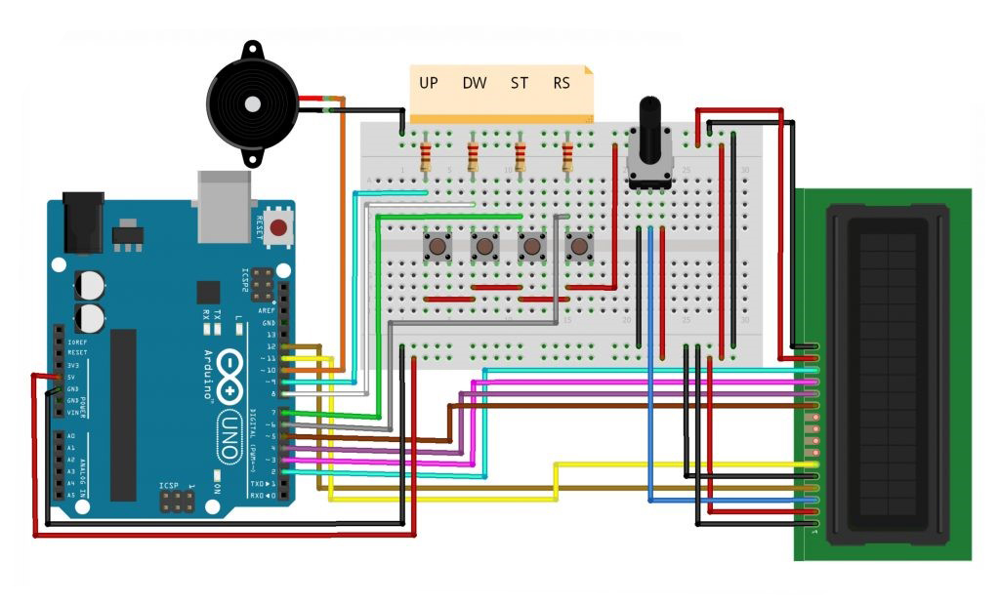

# CounterDown Timer (Timer Penghitung Waktu Mundur)

This project is a **Countdown Timer** using an Arduino and LCD display. It allows the user to set hours, minutes, and seconds and start or reset the countdown. Once the time reaches zero, a buzzer sounds to indicate the end of the countdown.

A countdown timer is a tool that functions to show time whose working principle is by counting down. Countdown timers can be engineered into a microcontroller with additional components such as buttons and LCD screens.

## Features

- Set up hours, minutes, and seconds for the countdown
- Start, stop, or reset the timer using buttons
- Buzzer alert when the countdown reaches zero
- LCD display to show the current time and countdown status

## Components (Tools & Materials)

- Arduino Uno = 1 unit;
- 16x2 LCD Display = 1 unit;
- Buzzer = 1 unit;
- Push buttons (Start/Stop, Reset, Up, Down) = 4 unit;
- Potensiometer 10kΩ = 1 unit;
- Resistor 220Ω = 4 unit;
- Breadboard / ProjectBoard = 1 unit;
- Jumper wires.

## # Schematic:

- Below you can see a schematic image to facilitate the wiring of cables from the microcontroller to devices, both input and output sensors:

## Information Pin-Configuration:

- Pin pada LCD:
  • Pin VSS – Ground
  • Pin VDD – 5V
  • Pin VO – Potensio
  • Pin RS – Pin 12 Arduino
  • Pin R_W – Ground
  • Pin E – Pin 11 Arduino
  • Pin DB4 – Pin 5 Arduino
  • Pin DB5 – Pin 4 Arduino
  • Pin DB6 – Pin 3 Arduino
  • Pin DB7 – Pin 2 Arduino
  • Pin A – 5V
  • Pin K – Ground
- Reset Button: Pin 6;
- Start/Stop Button: Pin 7;
- Down Button: Pin 8;
- Up Button: Pin 9;
- Buzzer: Pin 10

## How It Works

1. **Setup Mode**: Use the Up and Down buttons to set the hours, minutes, and seconds for the countdown.
2. **Idle Mode**: The timer is ready to be started by pressing the Start/Stop button.
3. **Running Mode**: The countdown begins, and the current time is displayed on the LCD.
4. **Ringing Mode**: Once the timer hits zero, the buzzer sounds to indicate time is up. Press any button to stop the ringing.

## Code Explanation

- The program uses the `LiquidCrystal` library to control the LCD display.
- The `TimeLib` library is used to handle time-based functions.
- Buttons are used to control the setup and running of the countdown.
- The buzzer is activated when the countdown finishes.

## Usage

1. Upload the code to your Arduino Uno.
2. Connect the components as per the pin configuration.
3. Use the buttons to set and control the timer.

## Conclusion :  

In this project there is a timer with 4 modes, namely:  

1. Idle : the timer waits for your input and shows the currently set amount of time. This mode is also the initial mode after power on or reset.  
2. Setup: You can enter this mode by long pressing RS(Reset). here, using ST(start stop button), you can choose which value to change to set the time to count down later. finally, using DW (down button) and UP (up button), you can decrease or increase the selected value (hours, minutes or seconds).  
3. Running: You can enter this mode by pressing ST, while exiting this mode will require ST or RS (which will take you to IDLE mode).  
4. Ringing: When the desired time has passed, this mode is automatically active. You can return it to its original state by pressing any button.  
"# CounterDown-Timer" 
